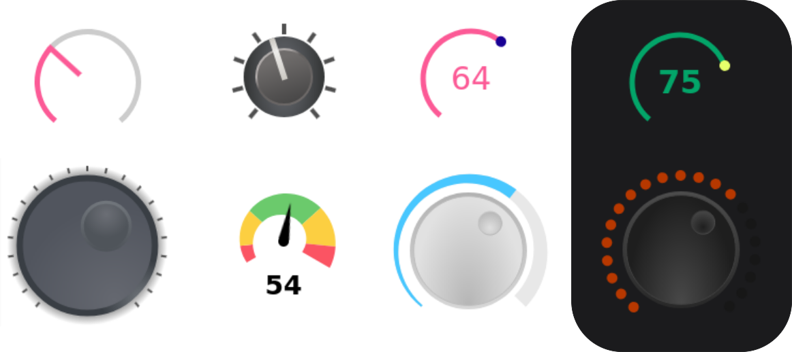

# rc-knob

Renders a react knob component that can be widely customised.



## Installation

```
npm install @vallsv/rc-knob
yarn add @vallsv/rc-knob
```

## Documentation and examples

- https://vallsv.github.io/rc-knob/
- https://eskimoblood.github.io/rc-knob/ (older version)

## Usage

The main idea is to split the user interaction and value calculation from the actual
rendering of typical knob elements like pointer, scale or value.

So all logic is done in the `Knob` component which is the root component.

All visual UI is done in one of this components: `Arc`, `Pointer`, `Scale`, `Value`
and few others.

All the UI components don't do anything beside rendering and are useless on their own.
They need the context sharing the knob state which is provided from the parent `Knob`
component.

Finally everything is rendered as SVG.

A simple knob with a pointer and value would look like this: 

```
import React from 'react'
import { Knob, Pointer, Value } from '@vallsv/rc-knob'

export default () => (
    <Knob>
        <Value />
        <Pointer width={1} height={2}/>
    </Knob>
)
```
