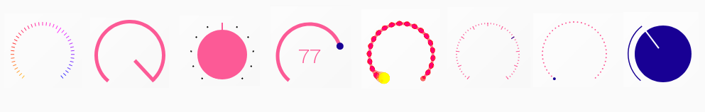

# rc-knob

Renders a react knob component that can be widely customised.



## Installation
```
npm install rc-knob
yarn add rc-knob
```

## Examples

- https://vallsv.github.io/rc-knob/
- https://eskimoblood.github.io/rc-knob/ (older version)

## Usage

The main idea is to split the user interaction and value calculation from the actual rendering of typical knob elements like pointer, scale or value. 
So all logic is done in the [`Knob`](#Knob) component which is the root component. 

All visual UI is done in one of this components: [`Arc`](#Arc), [`Pointer`](#Pointer), [`Scale`](#Scale) and [`Value`](#Value).
All UI elements are rendered as SVG.   

All the UI component don't to anything beside rendering and are useless on their own as they need a bunch of props that they get from the parent [`Knob`](#Knob) component to render the current value of the knob. 

A simple knob with a pointer and value would look like this: 

```
import React from 'react'
import { Knob, Pointer, Value } from 'rc-knob'

export default ()=> (
    <Knob>
        <Value />
        <Pointer width={1} height={2}/>
    </Knob>
)
```

## API

### `<Knob/>`

The Knob component is root component that handles all the user interactions. 
I does not render any visual UI elements but an `<div><svg></svg></div>`.
All children will be added to the `<svg>` element.
It handles the user interaction by mouse, mouse wheel and keyboard arrow keys.
It is accessible by keyboard using `tab`.

#### Props

| Prop | Type | Default | Description |
|------|------|---------|-------------|
| `angleOffset` | number | 0 | Offset of the start angle in degree of the knob. The origin `0` in on top and clockwise. |
| `angleRange` | number | 360 | Graphical range of the knob in degree clockwise. |
| `ariaLabelledBy` | string | | Will be added as `aria-labelledby` to the knob main element. |
| `ariaValueText` | string | | Will be added as `aria-valuetext` to the knob main element. |
| `children` | elements | | Can be any of knob subcomponents and SVG elements including `filter`. |
| `className` | string | | Will be added to the knob main element. |
| `interactiveHook` | function | | Callback to tune the behaviour of the knob during the mouse interaction. See the [details on `interactiveHook`](#interactiveHook) bellow. |
| `max` | number | | Max value of the knob. |
| `min` | number | | Min value of the knob. |
| `multiRotation` | boolean | false | If `true`, the knob can be turned many times. `min`/`max` are not taken into acount anymore to limit the value.
| `onChange`| function | | Callback that will pass the value when user interact with the knob. If `tracking=false` this callback is not called during mouse dragging, but is triggered when the mouse is release (if the value have changed) |
| `onEnd` | function | | Callback triggered when the dragging end. |
| `onInteractiveChange` | function | | Callback that will pass the value during dragging. |
| `onStart` | function | | Callback triggered when the dragging start. |
| `readOnly`| boolean | false | Indicates if the knob is editable. If true the knob do not react to user input
| `size` | integer | | Width and height of the knob in `px` |
| `snap` | boolean | false | Indicates if the knob should snap to a step. Has only an effect if `steps` is set.
| `steps` | interger | | Number of steps the knob can snap to. It's also used to calculate the single steps for the `Scale` component.
| `tracking` | boolean | true | Control the behaviour of `onChange` during mouse dragging. If `true`, `onChange` is triggered during mouse dragging. If `false`, `onChange` is not triggered during mouse dragging, but is triggered when the mouse is release (if the value have changed).
| `useMouseWheel` | boolean | true | Indicates if the knob can be edited with the mouse wheel. If `true` the knob uses mouse wheel event, and the default wheel event is inhibited. Set to `false` can prevent to edit the widget during page scroll. Default is `true`. |
| `value` |  number | 0 | Initial value of the knob

#### interactiveHook

This hook allow to configure the knob to behave in different way depending on
the location of the mouse during the interaction.

A dedicated event is passed to this callback during the mouse interaction
containing:

- `mouseRadius`, the radius location of the mouse into the knob
- `mouseAngle`, the angle (in degree, in range `0..360`) location of the mouse
  into the knob (using the same referential as `angleOffset`: `0` on top,
  clockwise)
- `mouseX`, the X location on the mouse relative to the center of the knob
- `mouseY`, the Y location on the mouse relative to the center of the knob
- `ctrlKey`, inherited from `MouseEvent`
- `altKey`, inherited from `MouseEvent`
- `metaKey`, inherited from `MouseEvent`
- `shiftKey`, inherited from `MouseEvent`

The callback have to return a specific dictionary, which can contain:

- `readOnly`, if `true`, the mouse event is inhibited
- `steps`, number of intervales to snap on

Here is an example of such callback:

```
function interactiveHook(e) {
    if (e.mouseRadius < 20) {
        // inhibite the center of the knob
        return {readOnly: true}
    }
    // default
    return {}
}
```

### `<Arc/>`

Renders an arc that indicates the current knob value.

#### Props

| Prop | Description |
|------|-------------|
| `arcWidth` | Width of the arc. The arc will expand to the centre.
| `background` | Color of the arc over the whole range of the knob. If `background` is not set, the background arc will not rendered.
| `color` | Color of the arc that indicates the value of the knob.
| `radius` | Outer radius of the arc. Will be the knob `size` by default

### `<Range/>`

Renders a range between 2 angles.

#### Props

| Prop | Description |
|------|-------------|
| `arcWidth` | Width of the arc. The arc will expand to the centre.
| `color` | Color of the range.
| `percentFrom` | Starting point of the range. If unset, `percent` value of the knob is used.
| `percentTo` | Ending point of the range. If unset, `percent` value of the knob is used.
| `radius` | Outer radius of the arc. Will be the knob `size` by default

### `<Spiral/>`

Renders a spiral between 2 angles.

#### Props

| Prop | Description |
|------|-------------|
| `arcWidth` | Width of the spiral line. The spiral will expand to the centre.
| `color` | Color of the spiral.
| `percentFrom` | Starting point of the spiral. If unset, `percent` value of the knob is used.
| `percentTo` | Ending point of the spiral. If unset, `percent` value of the knob is used.
| `radiusFrom` | Outer radius of the start point of the spiral.
| `radiusTo` | Outer radius of the ending point of the spiral.

### `<Pointer/>`

Pointer of the knob.
Can be either be a `rect`, `circle` or `triangle` depending on the
passed `type` prop or any SVG element that is passed as a children.

#### Props

| Prop | Description |
|------|-------------|
| `children` | Can be any SVG element or a component that will render a SVG element. If you pass a component the percentage of the current value will be passed as a prop. The element will be rendered as pointer. Note, that you have to pass `width` and `height` as props to make calculate the correct position.
| `className` | Will be added to the predefined shape or the children.
| `color` | Color of the pointer.
| `height` | Height of the `rect` or the custom element. Will be ignored for circle. Will be the same as `width` if not set.
| `radius` | Outer radius of the circle the pointer sits on.
| `type` | Can be `rect`, `circle` or `triangle`. Will render the according SVG element. `width` and/or `height` props needs to be set.
| `width` | Width of the `rect` or the custom element. Radius when type is set to `circle`.

### `<Label/>`

Label to display in the knob. In polar coordinates.

#### Props

| Prop | Description |
|------|-------------|
| `className` | Will be added to the SVG `text` element.
| `label` | Label to display.
| `percentage` | Location of the label in percentage of the value range
| `radius` | Radius of the center of the label
| `style` | Will be added to the SVG `text` element.
| `userSelect` | Added to the style. Default is `none` to avoid text selection.

### `<Scale/>`

Renders a radial scale.
The number of ticks is set by the `step` prop of the parent [`Knob`](#Knob) component.

The single scale tick can be a SVG `rect` or `circle`. 
Additionally a render function can be passed as a prop, that will render each tick.

This is useful if the scale ticks should have different colors, or different tick length for every 10th tick for example.

#### Props

| Prop | Description |
|------|-------------|
| `type` | Can be `rect` or `circle`, default is `rect`. Will render the according SVG element. `tickWidth` and/or `tickHeight` props needs to be set.
| `radius` | Outer radius where the ticks ends.
| `tickWidth` | Width of a single tick. Used as radius if type is `circle`.
| `tickHeight` | Height of a single tick. Is ignored when type is `circle`.
| `color` | Will be passed as color prop to the render SVG element of a tick or to the custom render function.
| `activeColor` | Color for the tick that indicates the same value as the current knob value.
| `className` | Will be passed as prop to the render SVG element of a tick or to the custom render function.
| `activeClassName` | `className` for the tick that indicates the same value as the current knob value.
| `fn` | Function that can be used to have the full control over how a tick is rendered. The function needs to return a SVG element. See details on [fn function](#custom-function) bellow.

#### Custom function

The property `fn` is a function which get the following props passed:

Function that can be used to have the full control over how a tick is rendered.
The function needs to return a SVG element.
The function will get the following props passed:

- `active`
- `activeClassName`
- `activeColor`
- `angleOffset`
- `center`
- `className`
- `color`
- `stepSize`
- `tickHeight`
- `translateX`
- `translateY`
- `tickWidth`
- `percentage`
- `steps`

Most of them are just passed down from the [`Pointer`](#Pointer) or the
[`Knob`](#Knob). 

Additional are:

- `center`, the half of the [`size`](#size) of the [`Knob`](#Knob)
- `stepSize`, the size of the angle of one step in degree
- `translateX`, `translateY` that are needed to put the tick on the correct
  position using the transform prop e.g:
  ``transform={`translate(${translateX} ${translateY})`}``
- `i` which is the index of the current tick.

### `<Value/>`

Render the current value as SVG text element.

#### Props

| Prop | Description |
|------|-------------|
| `decimalPlace` | Number of decimal places the value should rendered with.Is `0` by default.
| `className` | `className` that is passed to the SVG `text` component.
| `marginBottom` | Useful to adjust the horizontal position of the text inside of the [`Knob`](#Knob).
